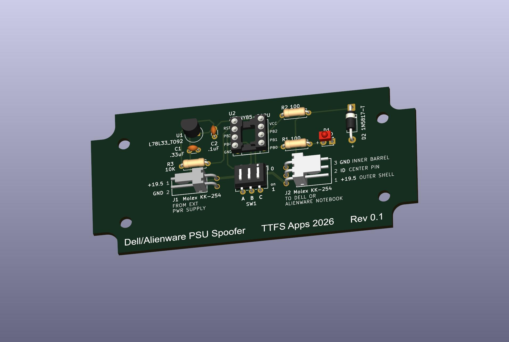

# Dell/Alienware PSU Spoofer 
Allows user to use any lab power supply to power a Dell or Alienware notebook pc by supplying the required Dell PSU ID string. Dell and Alienware computers require the ID string to run normally. Performance is throttled if no ID string is provided for power protection purposes. The spoofer is configurable to send the ID string that matches the input lab supply's power rating via dipswitches. 

## Hardware Required
Custom PCB design which uses an Atmel ATtiny85 microcontroller and OneWireHub to emulate a Maxim DS2502, a 1Kb Add-Only Memory device with a unique 48-bit serial number, programmable EPROM, and 1-Wire interface. The DS2502 is used by Dell and Alienware OEM PSU's to determine the PSU's wattage. It appears that the notebook pc's do not use any of the other information provided in the Dell ID string other than wattage.

## KiCad Files
[KiCad Schematic](kicad/dell_psu_spoofer.kicad_sch)

[KiCad PCB](kicad/dell_psu_spoofer.kicad_pcb)

[KiCad BOM](kicad/dell_psu_spoofer.csv)

[Gerber File](kicad/dell_psu_spoofer.kicad_pcb.zip)

## Libraries Required
|Library|Function|
|:-----:|:-----:|
|[OneWireHub.h](https://github.com/orgua/OneWireHub)|OneWireHub library| 
|DS2502.h|included with OneWireHub library| 

## DIP Switch Settings
|A|B|C|Watts|
|:-----:|:--------:|:-------:|:-----:|
|0|0|0|75|
|0|0|1|100|
|0|1|0|125|
|0|1|1|150|
|1|0|0|175|
|1|0|1|200|
|1|1|0|225|
|1|1|1|250|

## Pin Names, Numbers, and Functions
|||||||||
|:--:|:--:|:--:|:--:|:--:|:--:|:--:|:--:|
|ATtiny85 Pin|5|1|7|6|3|2|ATtiny85 hardware pin numbers (reference only)|
|Pin Name|PB0|PB5/RST|PB2|PB1|PB4|PB3|ATtiny85/Arduino pin names|
|Arduino Pin #|0|5|2|1|4|3|Arduino IDE pin numbers (s/w uses these)|
|PCB Label|LED|RST|ID|A|B|C|Pin function|
|Function||not used|OneWire|Power Select|Power Select|Power Select|

TTFS Apps 2026
